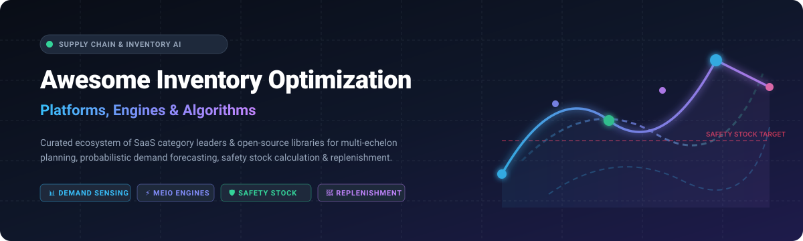

# 📦 Awesome Inventory Optimization Platform [](https://github.com/ishandutta2007/Awesome-Awesome-Awesome)

<p align="center">
  
</p>

<p align="center">
  <a href="https://github.com/ishandutta2007/Awesome-Awesome-Awesome"></a>
  <a href="https://discord.gg/jc4xtF58Ve"></a>
  <a href="https://github.com/ishandutta2007/Awesome-Inventory-Optimization-Platform/stargazers"></a>
  <a href="https://github.com/ishandutta2007/Awesome-Inventory-Optimization-Platform/network/members"></a>
  <a href="https://github.com/ishandutta2007/Awesome-Inventory-Optimization-Platform/blob/main/LICENSE"></a>
  <a href="https://github.com/ishandutta2007/Awesome-Inventory-Optimization-Platform/pulls"></a>
  <a href="https://github.com/ishandutta2007"></a>
</p>

---

## 🧭 Overview & Ecosystem Guide

Welcome to the **Awesome Inventory Optimization Platform** repository — a curated compendium of leading **SaaS Solutions**, **Open-Source Software**, **Mathematical Frameworks**, and **Algorithmic Toolkits** dedicated to modern supply chain planning and inventory engineering.

Whether you are seeking an enterprise-scale planning suite or building internal decision models from scratch, this resource indexes tools across essential optimization disciplines:
- 📊 **Demand Forecasting & Sensing**: Probabilistic forecasting, intermittent demand modeling, Bayesian time-series, and machine learning.
- 🛡️ **Safety Stock & Buffer Optimization**: Cycle stock sizing, service-level targeting ($OTIF$, fill rate, cycle service level), and lead-time variability management.
- 🌐 **Multi-Echelon Inventory Optimization (MEIO)**: Stochastic- and guaranteed-service network optimization across suppliers, plants, regional distribution centers (RDCs), and retail stores.
- 🔄 **Automated Replenishment & SIOP**: Dynamic reorder points ($ROP$), Economic Order Quantity ($EOQ$), $(s, S)$ and $(R, s, S)$ inventory policies.

---

## 📑 Table of Contents
- [🏢 SaaS & Commercial Hosted Platforms](#-saas--commercial-hosted-platforms)
- [💻 Open-Source GitHub Projects](#-open-source-github-projects)
- [📚 Essential Architecture & Custom Stacks](#-essential-architecture--custom-stacks)
- [🤝 How to Contribute](#-how-to-contribute)
- [📈 Star History](#-star-history)
- [⚖️ Disclaimer](#️-disclaimer)

---

## 🏢 SaaS & Commercial Hosted Platforms

> 📊 **Market Overview & Industry Structure**: The global **Supply Chain Planning & Inventory Optimization Software** market is valued at approximately **$5.2 Billion – $6.8 Billion (2026)** and is projected to expand at a **CAGR of 10.5% – 12.2%**. The market is **moderately fragmented**: it is characterized by a multi-tiered competitive landscape where mega-cap enterprise suites (e.g., Blue Yonder, SAP, Manhattan Associates) dominate global multi-national corporations, while specialized, high-agility "best-of-breed" optimization engines (e.g., RELEX Solutions, Netstock, ToolsGroup, Lokad) capture significant market share across retail, wholesale distribution, and fast-growing mid-market supply chains.

The table below is sorted by **Company Size / Valuation (Descending)**:

| Platform | Company Size (Revenue / Valuation) | Description | Pricing (Starting Tier) | Free Tier / Free Trial Limits |
| :--- | :--- | :--- | :--- | :--- |
| 👑 **[Blue Yonder](https://blueyonder.com/)** | **~$8.5B Valuation**<br>*(~$1.1B+ Annual Revenue; Panasonic)* | Enterprise supply chain operating platform delivering AI-driven demand forecasting and multi-echelon inventory optimization. | Starts at **$8,333/month** (~$100,000/year base module tier) | No free tier; custom proof-of-value sandbox during procurement (0 days self-service) |
| 🦄 **[RELEX Solutions](https://www.relexsolutions.com/)** | **~$5.7B Valuation**<br>*(~$200M+ ARR; Blackstone backed)* | Unified retail planning platform automating demand forecasting, multi-echelon replenishment, and localized space planning. | Starts at **$4,500/month** (base regional retail deployment tier) | No free tier; guided proof-of-value simulation during sales consultation (0 days self-service) |
| 🏢 **[Logility](https://www.logility.com/)** | **~$350M – $400M Market Cap**<br>*(~$110M – $125M Revenue; AMSWA)* | Digital supply chain platform featuring DemandAI+, inventory policy simulation, and network replenishment. | Starts at **$3,500/month** (entry cloud deployment for mid-market) | No free tier; interactive guided demo & supply chain readiness review (0 days self-service) |
| 🚀 **[ToolsGroup](https://www.toolsgroup.com/)** | **~$300M – $500M Valuation**<br>*(~$80M – $100M ARR; Accel-KKR)* | Probabilistic forecasting and service-level driven multi-echelon inventory optimization (SO99+) software. | Starts at **$2,500/month** (via Pay-As-You-Grow program / starter tier) | No free tier; guided pilot and scenario test on request (0 days self-service) |
| 📈 **[Netstock](https://www.netstock.com/)** | **~$150M – $200M Valuation**<br>*(~$50M – $60M ARR)* | Leading cloud inventory optimization platform for SMBs and mid-market distributors, integrating with 50+ ERPs. | Starts at **$900/month** (billed annually for core SMB/mid-market plan) | No free tier; guided live demo on request (0 days self-service trial) |
| ⚙️ **[GAINS Systems](https://www.gainsystems.com/)** | **~$150M Valuation**<br>*(~$30M – $50M ARR; Francisco Partners)* | AI-powered supply chain and multi-echelon inventory optimization for complex asset and spares environments. | Starts at **$4,166/month** (~$50,000/year base feature starting tier) | No free tier; tailored product demo & supply chain readiness review (0 days self-service) |
| 📦 **[Slimstock (Slim4)](https://www.slimstock.com/)** | **~$60M – $80M ARR**<br>*(Bootstrapped / Private Leader)* | Enterprise inventory planning, demand forecasting, safety stock calculation, and replenishment suite. | Starts at **$2,500/month** (mid-market entry tier with annual commitment) | No free tier; consultant-led inventory assessment & live demo on request (0 days self-service) |
| 💡 **[ThroughPut AI](https://throughput.ai/)** | **~$30M – $50M Valuation**<br>*(~$5M – $10M ARR; Venture-backed)* | AI decision intelligence software uncovering supply chain bottlenecks, inventory waste, and material flow risks. | Starts at **$1,200/month** (entry decision engine tier) | **ThroughPut Lite** free self-serve plan (unlimited duration with data upload limits) |
| 🔧 **[Smart Software (Smart IP&O)](https://smartcorp.com/)** | **~$25M – $40M Revenue**<br>*(Acquired by Epicor)* | Statistical demand forecasting, intermittent demand modeling, and SIOP inventory policy optimization. | Starts at **$2,000/month** (Small Business tier, billed annually) | No free tier; 14-day guided proof-of-concept / live demo with company data upon consultation |
| 🌐 **[Blue Ridge Global](https://www.blueridgeglobal.com/)** | **~$20M – $35M ARR**<br>*(PeakEquity backed)* | Cloud supply chain planning and multi-echelon replenishment suite tailored for wholesale distributors. | Starts at **$1,800/month** (base cloud subscription tier) | No free tier; guided interactive demo & business-case assessment on request (0 days self-service) |
| 📊 **[EazyStock](https://www.eazystock.com/)** | **~$15M – $25M ARR**<br>*(Syncron Group ~$70M+ ARR)* | Cloud-based inventory replenishment tool designed for SMBs to automate purchase orders and eliminate excess stock. | Starts at **$640/month** (standard SMB starter tier) | No free tier; 30-day proof-of-concept / guided pilot demo upon consultation |
| 🏷️ **[StockIQ](https://www.stockiqtech.com/)** | **~$10M – $20M ARR**<br>*(Specialist Provider)* | Supply chain planning and inventory optimization software purpose-built for 3PLs, distributors, and manufacturers. | Starts at **$750/month** (entry tier based on ERP integration & SKU count) | No free tier; custom interactive walkthrough and sandbox demo on request (0 days self-service) |
| 🔬 **[Lokad](https://www.lokad.com/)** | **~$5M – $15M ARR**<br>*(Pioneering Quant Boutique)* | Quantitative supply chain optimization platform utilizing probabilistic forecasts and financial ROI optimization via Envision. | Starts at **$150/month** (basic programmatic tier; Premier starts at $2,500/month) | Free access to web-based **Envision Playground** sandbox; free trial accounts upon email request (`contact@lokad.com`) |

---

## 💻 Open-Source GitHub Projects

The following open-source libraries, planning engines, and reference implementations provide robust foundations for custom algorithmic inventory systems.

The table below is sorted by **GitHub Stars (Descending)**:

| Repository & Link | GitHub Stars | Language / Ecosystem | Primary Domain & Key Capabilities |
| :--- | :---: | :--- | :--- |
| **[Odoo (Inventory & MRP)](https://github.com/odoo/odoo)** | [](https://github.com/odoo/odoo/stargazers) | Python / JS | Enterprise open-source ERP with double-entry inventory tracking, multi-warehouse routing, automated reorder rules, and manufacturing MRP. |
| **[ERPNext](https://github.com/frappe/erpnext)** | [](https://github.com/frappe/erpnext/stargazers) | Python / JS | Full-featured open-source ERP offering real-time stock ledger, automated replenishment triggers, multi-currency purchasing, and batch/serial control. |
| **[InvenTree](https://github.com/inventree/InvenTree)** | [](https://github.com/inventree/InvenTree/stargazers) | Python / Django | Lightweight, modular, open-source inventory management system with stock tracking, supplier management, bill of materials (BOM), and REST API. |
| **[PuLP (COIN-OR)](https://github.com/coin-or/pulp)** | [](https://github.com/coin-or/pulp/stargazers) | Python | Linear programming modeler commonly used to formulate and solve safety stock allocation, multi-echelon network flow, and lot-sizing problems. |
| **[frePPLe](https://github.com/frePPLe/frepple)** | [](https://github.com/frePPLe/frepple/stargazers) | C++ / Python | Open-source demand forecasting, inventory planning, and Advanced Planning & Scheduling (APS) engine under MIT license. |
| **[Stockpyl](https://github.com/LarrySnyder/stockpyl)** | [](https://github.com/LarrySnyder/stockpyl/stargazers) | Python | Comprehensive library implementing classical inventory models (EOQ, Newsvendor, Wagner-Whitin) and stochastic/guaranteed-service MEIO algorithms. |
| **[SupplySeer](https://github.com/supplyseer-ai/supplyseer)** | [](https://github.com/supplyseer-ai/supplyseer/stargazers) | Python | Computational supply chain toolkit featuring Bayesian EOQ, probabilistic demand modeling, lead-time uncertainty analysis, and optimization scripts. |
| **[Multi-Echelon Inventory Optimization](https://github.com/anshul-musing/multi-echelon-inventory-optimization)** | [](https://github.com/anshul-musing/multi-echelon-inventory-optimization/stargazers) | Python (SimPy / SciPy) | Simulation-optimization framework using SimPy discrete-event simulation and RBFOpt black-box optimizers for complex multi-echelon networks. |
| **[Multi-Agent DRL for Inventory Management](https://github.com/xiaotianliu01/Multi-Agent-Deep-Reinforcement-Learning-on-Multi-Echelon-Inventory-Management)** | [](https://github.com/xiaotianliu01/Multi-Agent-Deep-Reinforcement-Learning-on-Multi-Echelon-Inventory-Management/stargazers) | Python / PyTorch | Multi-agent deep reinforcement learning framework for multi-echelon inventory control, mitigating the Bullwhip effect across supply tiers. |
| **[Demand Forecasting & Inventory Optimization](https://github.com/DavieObi/Demand-Forecasting-and-Inventory-Optimization)** | [](https://github.com/DavieObi/Demand-Forecasting-and-Inventory-Optimization/stargazers) | Python / Jupyter | End-to-end pipeline applying time-series forecasting (ARIMA), safety stock computation, reorder points, and optimal order quantities. |
| **[Inventory Optimization Notebooks](https://github.com/fedinb/Inventory-Optimization)** | [](https://github.com/fedinb/Inventory-Optimization/stargazers) | Python / Jupyter | Educational scripts implementing safety stock formulas, cycle stock trade-offs, fill-rate simulations, and service-level cost optimization. |

---

## 📚 Essential Architecture & Custom Stacks

When architecting an in-house enterprise inventory planning stack, standard practice combines open-source components across 5 layers:

```
┌────────────────────────────────────────────────────────┐
│ 1. Transactional ERP / Master Data (ERPNext / Odoo)     │
└───────────────────────────┬────────────────────────────┘
                            │ (SKU, Sales Orders, Purchase Orders, Lead Times)
┌───────────────────────────▼────────────────────────────┐
│ 2. Demand Forecasting Layer (Nixtla / Prophet / Darts) │
└───────────────────────────┬────────────────────────────┘
                            │ (Point & Probabilistic Forecast Distributions)
┌───────────────────────────▼────────────────────────────┐
│ 3. Inventory Optimization Engine (Stockpyl / PuLP)     │
└───────────────────────────┬────────────────────────────┘
                            │ (Safety Stock, ROP, Order Quantities, MEIO Policies)
┌───────────────────────────▼────────────────────────────┐
│ 4. Simulation & Validation (SimPy Discrete Event Sim)  │
└───────────────────────────┬────────────────────────────┘
                            │ (Stress Testing Service Levels & Holding Costs)
┌───────────────────────────▼────────────────────────────┐
│ 5. Operational Execution (Push Replenishment Orders)   │
└────────────────────────────────────────────────────────┘
```

1. **System of Record**: Store item master data, purchase history, and bills of materials in **[ERPNext](https://github.com/frappe/erpnext)**, **[Odoo](https://github.com/odoo/odoo)**, or **[InvenTree](https://github.com/inventree/InvenTree)**.
2. **Demand Input**: Generate quantile/probabilistic demand distributions using modern time-series packages (`StatsForecast`, `NeuralForecast`, `Prophet`).
3. **Policy Determination**: Run **[Stockpyl](https://github.com/LarrySnyder/stockpyl)** or **[SupplySeer](https://github.com/supplyseer-ai/supplyseer)** to calculate target safety stocks and dynamic reorder thresholds under service constraints ($OTIF \ge 98\%$).
4. **Network Simulation**: Validate stocking policies under simulated supply shocks using discrete-event simulations (`SimPy`).
5. **Execution**: Sync recommended purchase quantities back to the ERP via REST API for automated purchase order creation.

---

## 🤝 How to Contribute

We actively welcome contributions to keep this ecosystem comprehensive, accurate, and up-to-date!

1. 🍴 **Fork the repository**.
2. 🌿 **Create a feature branch** (`git checkout -b add-awesome-tool`).
3. 📝 **Add/Update entries**:
   - Provide the platform/library name, official URL, transparent starting pricing, free tier/trial specifications, and an objective summary.
4. ✅ **Commit your changes** with a concise message.
5. 🚀 **Submit a Pull Request**!

⭐ Don't forget to **Star the repository** if you find it helpful for your supply chain and analytics workflows!

---

## 📈 Star History

[](https://star-history.dera.page/#ishandutta2007/Awesome-Inventory-Optimization-Platform&type=date&legend=top-left)

---

## ⚖️ Disclaimer

- This repository is a **community-curated index** and does not constitute an endorsement or commercial sponsorship.
- Inventory optimization decisions directly impact working capital, customer service levels, and operational continuity. All models (commercial algorithms or open-source scripts) should be validated against your business constraints, demand volatility, and supplier lead-time distributions prior to live automated ordering.

---

<p align="center">
  <b>Built for Supply Chain Analysts, Demand Planners, Operations Researchers &amp; Logistics Engineers.</b>
</p>